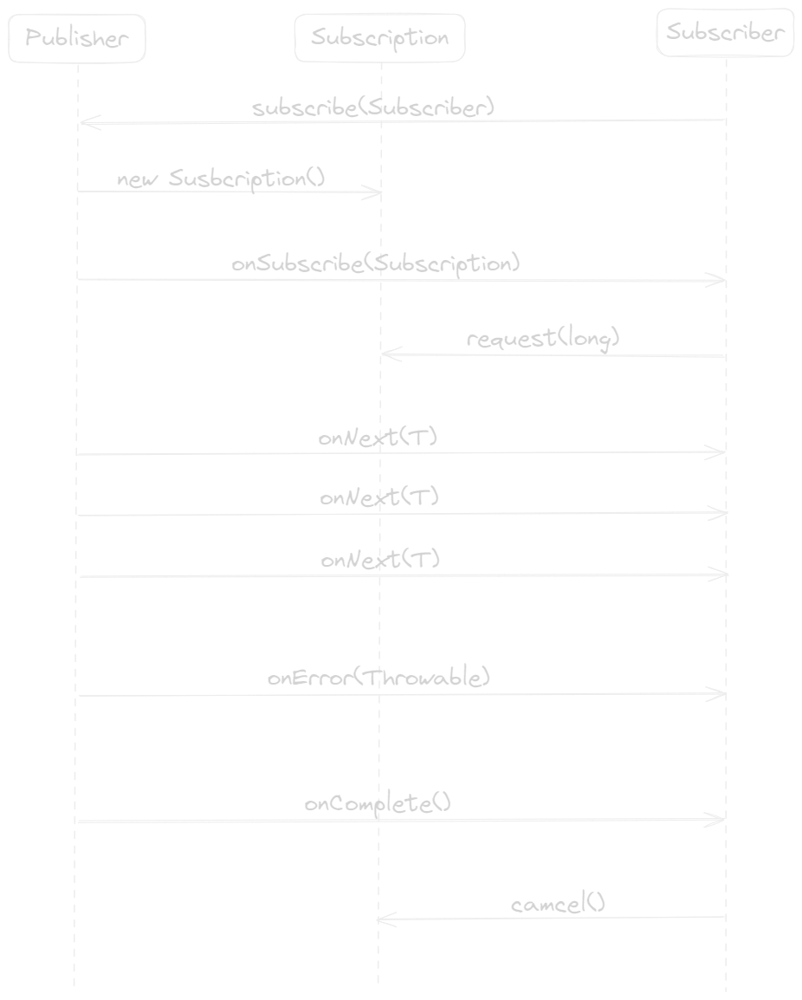

# Reactive Spring

## Understanding Reactive Programming

`Reactive Programming` is an asynchronous programming paradigm focused on streams of data, it's functional and declarative in nature. Instead of describe a set of steps that are to 
be performed sequentially, reactive programming involves describing a pipeline (or stream) through which data flows. Rather than requiring the data to be available and processed 
as a whole, a reactive stream processes data as it become available. In fact, the incoming data may be endless.

"_Reactive programs maintain a continuous interaction with their environment, but at a speed which is determined by the environment, not the program itself. Interactive programs work
at their own pace and mostly deal with communication, while reactive programs only work in response to external demands and mostly deal with accurate interrupt handling. Real-time 
programs are usually reactive_" - Gerad Berry.

## Reactive Streams
The `Reactive Streams` aims to provide a standard for asynchronous stream processing with non-blocking backpressure for various runtime environments (JVM, .NET, or JavaScript) and network
protocol. The specification describes the concept of `Reactive Streams` that have the following features:
- _Reactive Streams can be unicast and multicast_: A Publisher can send events to one or many consumers.
- _Reactive Streams are potentially infinite_: They can handle zero, one, many or infinite number of events.
- _Reactive Streams are sequential_: A consumer processes events in the same order in which a producer sends them.
- _Reactive Streams can be synchronous or asynchronous_: They can use computing resources for parallel processing in separate stages.
- _Reactive Streams are non-blocking_: They do not wast computing resources if the performance of a producer and a consumer are different.

The Reactive Streams API consist of four interface definitions:

- `Publisher`: Provider of a potentially unbounded number of sequenced elements, publishing them according to the demand received from its Subscriber. A Publisher can serve multiple
Subscribers subscribed dynamically at various points in time.
```java
public interface Publisher<T> {
    void subscribe(Subscriber<? super T> subscriber);
}
```

- `Subscriber`: Once a Subscriber has subscribed, it can receive events from the Publisher. Those events are sent via methods on the Subscriber interface. The first event that Subscriber
will receive is through a call to onSubscribe().
```java
public interface Subscriber<T> {
    void onSubscribe(Subscription sub);
    void onNext (T item);
    void onError (Throwable ex);
    void onComplete();
}
```

- `Subscription`: Represents a one-to-one lifecycle of a Subscriber subscribing to a Publisher. It can only be used by a single Subscriber. It is used to both signal desire for data and
cancel demand (and allow resource cleanup).
```java
public interface Subscription {
    void request(long n);
    void cancel();
}
```

- `Processor`: Represents a processing state which is both a Subscriber and a Publisher and obeys the contracts of both.
```java
public interface Processor<T, R> extends Subscriber<T>, Publisher<R> {}
```

**Notes:** _Backpressure_  is a means by which consumers of data can avoid being overwhelmed by an overly fast data source, by establishing limits on how much they're willing to handle.



## References
[Stephane Maldini & Simon Baslé, _Reactor 3 Reference Guide_](https://projectreactor.io/docs/core/release/reference/#intro-reactive)
