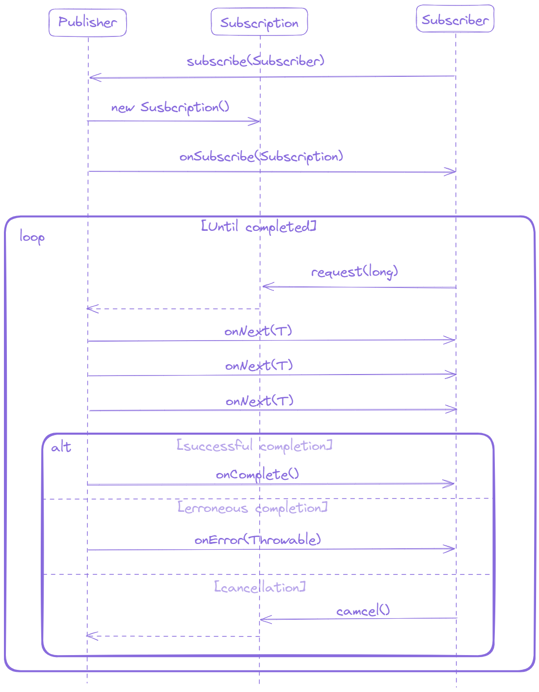

# Reactive Spring

## Table of Content
<!-- TOC -->
* [Reactive Spring](#reactive-spring)
  * [Table of Content](#table-of-content)
  * [Understanding Reactive Programming](#understanding-reactive-programming)
  * [Reactive Streams](#reactive-streams)
  * [Reactor Core](#reactor-core)
  * [References](#references)
<!-- TOC -->

## Understanding Reactive Programming

`Reactive Programming` is an asynchronous programming paradigm focused on streams of data, it's functional and declarative in nature. Instead of describe a set of steps that are to 
be performed sequentially, reactive programming involves describing a pipeline (or stream) through which data flows. Rather than requiring the data to be available and processed 
as a whole, a reactive stream processes data as it become available. In fact, the incoming data may be endless.

"_Reactive programs maintain a continuous interaction with their environment, but at a speed which is determined by the environment, not the program itself. Interactive programs work
at their own pace and mostly deal with communication, while reactive programs only work in response to external demands and mostly deal with accurate interrupt handling. Real-time 
programs are usually reactive_" - Gerad Berry.

## Reactive Streams
The `Reactive Streams` aims to provide a standard for asynchronous stream processing with non-blocking backpressure for various runtime environments (JVM, .NET, or JavaScript) and network
protocol. The specification describes the concept of `Reactive Streams` that have the following features:
- _Reactive Streams can be unicast and multicast_: A Publisher can send events to one or many consumers.
- _Reactive Streams are potentially infinite_: They can handle zero, one, many or infinite number of events.
- _Reactive Streams are sequential_: A consumer processes events in the same order in which a producer sends them.
- _Reactive Streams can be synchronous or asynchronous_: They can use computing resources for parallel processing in separate stages.
- _Reactive Streams are non-blocking_: They do not wast computing resources if the performance of a producer and a consumer are different.

The Reactive Streams API consist of four interface definitions:

- `Publisher`: Provider of a potentially unbounded number of sequenced elements, publishing them according to the demand received from one or many Subscribers. Demand is the aggregated
number of items requested by a Subscriber that haven't yet been delivered by the Publisher. The interface has the following method:
  - The subscribe(Subscriber) method requests the Publisher to start sending events to a Subscriber.
```java
public interface Publisher<T> {
    void subscribe(Subscriber<? super T> subscriber);
}
```

- `Subscriber`: Represents a consumer of events. Multiple Subscriber can subscribe to/unsubscribe from a Publisher at different times. This interface has the following methods:
  - The **onSubscribe(Subscription)** method is invoked when the Subscriber accepts a new Subscription.
  - The **onNext(T)** method is invoked on each received item.
  - The **onError(Throwable)** method is invoked on erroneous completion.
  - The **onComplete()** method is invoked on successful completion.
```java
public interface Subscriber<T> {
    void onSubscribe(Subscription sub);
    void onNext (T item);
    void onError (Throwable ex);
    void onComplete();
}
```

- `Subscription`: Represents a one-to-one lifecycle of a Subscriber subscribing to a Publisher. It can only be used by a single Subscriber. It is used to both signal desire for data and
cancel demand (and allow resource cleanup). This interface has the following methods:
  - The **request(long)** method adds the given number of items to the unfulfilled demand for this Subscription.
  - The **cancel()** method requests the Publisher to eventually stop sending items.
```java
public interface Subscription {
    void request(long n);
    void cancel();
}
```

- `Processor`: Represents a processing state which is both a Subscriber and a Publisher and obeys the contracts of both. It acts as a Subscriber for the previous stage of a reactive
stream and as a Publisher for the next one.
```java
public interface Processor<T, R> extends Subscriber<T>, Publisher<R> {}
```

**Notes:** `Backpressure` is a means by which consumers of data can avoid being overwhelmed by an overly fast data source, by establishing limits on how much they're willing to handle.

**Workflow**: consists of three steps:
- Establishing a connection
- Exchanging data and controlling events
- Successfully or exceptionally terminating the connection.

When a Subscriber wants to start receiving events from a Publisher, it calls the _Publisher.subscribe(Subscriber)_ method. If the Publisher accepts the request, it creates a new Subscription
instance and invokes the _Subscriber.onSubscribe(Subscription)_ method. If the Publisher rejects the request or otherwise fails, it invokes the _Subscriber.onError(Throwable)_ method.

Once the Publisher and the Subscriber establish a connection with each other through the Subscription instance, the Subscriber can request events, and the Publisher can send them. When the 
Subscriber wants to receive events, it calls the _Subscription#request(long)_ method with the number of items requested. Typically, the first such call occurs in the _Subscriber.onSubscribe(Subscription)_
method. The Publisher sends each requested item by calling the _Subscriber.onNext(T)_ method only in response to a previous request. A Publisher can send fewer events than requested if the
reactive stream ends, but then must call either the _Subscriber.onComplete()_ or _Subscriber.onError(Throwable)_ methods.

If the Subscriber wants to stop receiving events, it calls the _Subscription.cancel()_ method. After calling this method, the Subscriber can continue to receive events to meet the previously 
requested demand. A canceled Subscription does not receive _Subscriber.onComplete()_ or _Subscriber.onError(Throwable)_ events.

When there are no more events, the Publisher completes the Subscription successfully by calling the _Subscriber.onCompleted()_ method. When an unrecoverable exception occurs in the Publisher,
it completes the Subscription exceptionally by calling the _Subscriber.onError(Throwable)_ method. After invocation of _Subscriber.onComplete()_ or _Subscriber.onError(Throwable)_ events, the
current Subscription will not send any other events to the Subscriber.

<div style="text-align: center;">
    
</div>

## Reactor Core


- `Flux`

- `Mono`

## References
- [Stephane Maldini & Simon Baslé, _Reactor 3 Reference Guide_](https://projectreactor.io/docs/core/release/reference/#intro-reactive)
- [Craig Walls, _Spring in Action 6th Edition_](https://dl.ebooksworld.ir/books/Spring.in.Action.6th.Edition.Craig.Walls.Manning.9781617297571.EBooksWorld.ir.pdf)
